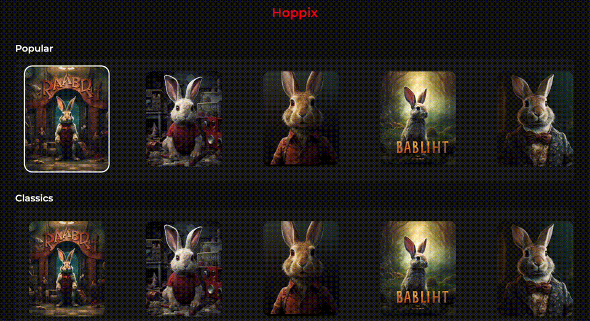

# react-tv-space-navigation

- [Why?](#why)
- [What you can achieve](#what-you-can-achieve)
- [How to use](#how-to-use)
- [How to run the example](#how-to-run-the-example)
- [API documentation](#api-documentation)
- [Pitfalls](#pitfalls)

# Why?

Spatial navigation is a hard problem on a TV app. Many solutions exist. React Native TV even has a core solution for it.
But most existing solutions are not 100% cross-platform.

If you want to develop a TV app for AndroidTV + tvOS + web TV devices, then this package will be helpful.

The library is based on LRUD, which is a UI-agnostic lib that represents spatial navigation. The library is a React wrapper around
the core logic of LRUD.

# What you can achieve



One of the goals of the lib is to have a simple and declarative API.
No need for hooks or dark shenanigans. You just simply declare components.

Here's the kind of code you'll be able to achieve:

```tsx
/**
 * A simple component that shows a rabbit program
 * We plug it to the Spatial Navigation easily using a Node
 */
const Rabbit = ({ onSelect }) => (
  <SpatialNavigationNode isFocusable onSelect={onSelect}>
    {({ isFocused }) => <RabbitLayout isFocused={isFocused} />}
  </SpatialNavigationNode>
);

/**
 * We can as many nodes as we want. We group our rabbits in a horizontal spatial navigation view
 * to spatially describe a row layout
 * (it includes a spatial navigation node AND the horizontal styling for it)
 *
 * We also want to scroll horizontally, so we add a horizontal scrollview.
 */
const RabbitRow = () => (
  <SpatialNavigationScrollView horizontal>
    <SpatialNavigationView direction="horizontal">
      {/* assuming you have rabbits data */}
      {rabbits.map((_, index) => (
        <Rabbit onSelect={() => console.log('selected rabbit ', index)} />
      ))}
    </SpatialNavigationView>
  </SpatialNavigationScrollView>
);

/**
 * Now I simply add a page with a Root node and a vertical scroll view to scroll through my rows.
 */
const Page = () => (
  <SpatialNavigationRoot>
    <SpatialNavigationScrollView>
      <RabbitRow />
      <RabbitRow />
      <RabbitRow />
      <RabbitRow />
      <RabbitRow />
      <RabbitRow />
    </SpatialNavigationScrollView>
  </SpatialNavigationRoot>
);
```

# How to use

You should [follow the tutorial](./docs/tutorial.md).

# How to run the example

If you want to run the example app in `packages/example`, take a look at [the README](./packages/example/README.md)

# API documentation

You can have a look at [the documentation](./docs/api.md).

# Pitfalls

You should have a look at [the pitfalls](./docs/pitfalls.md).

# Accessibility support

For now, accessibility support is experimental.
Since we bypass the native focus, and the screen readers rely on the native elements, it's
a difficult topic.

We export a hook that returns you props that you can provide to your focusable elements.
The main caveat is that your elements will still be focusable, but the user will need to press
enter to grab focus on an element, which is not standard at all.

We could not find a way to properly intercept the accessibility focus event, even with a React Native patch.

Help is welcome 🙂

# Contributing

## Publishing the package

- Increment the package.json in `./packages/lib/package.json`.
- Commit the change `git commit -m "chore: bump version"`
- Add a tag matching the version `git tag vx.x.x && git push --tags`
- Then publish it:

```
cd packages/lib
yarn publish:package
```
