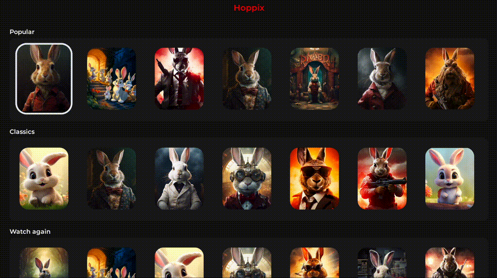

# Accessibility

For now, accessibility support is experimental with the library.
Here's a video of what we could achieve.

Since we bypass the native focus, and the screen readers rely on the native elements, it's
a difficult topic.

We export a hook that returns you props that you can provide to your focusable elements.
The main caveat is that your elements will still be focusable, but the user will need to press
enter to grab focus on an element, which is not standard at all.

We could not find a way to properly intercept the accessibility focus event, even with a React Native patch.

Help is welcome 🙂
