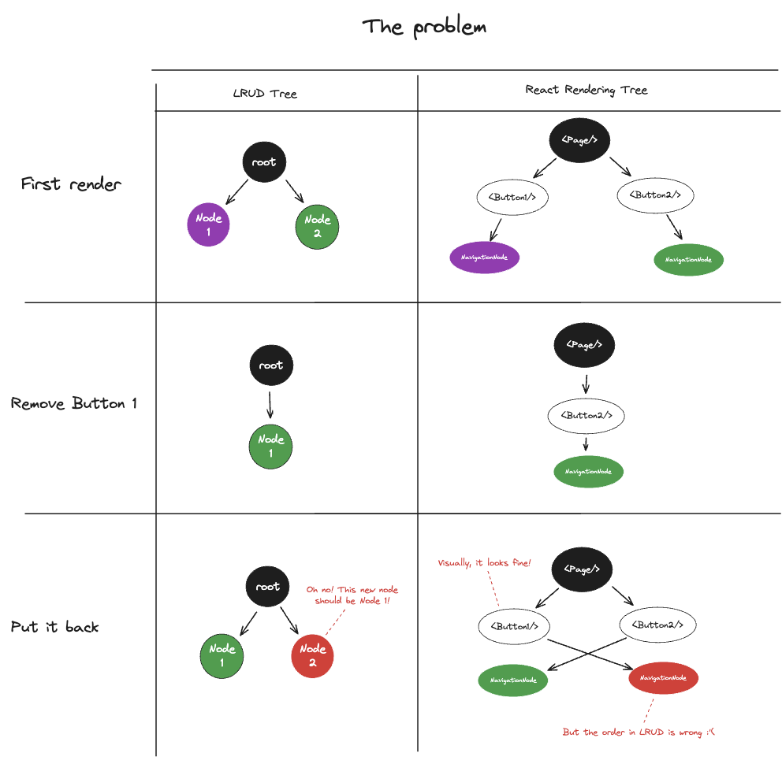
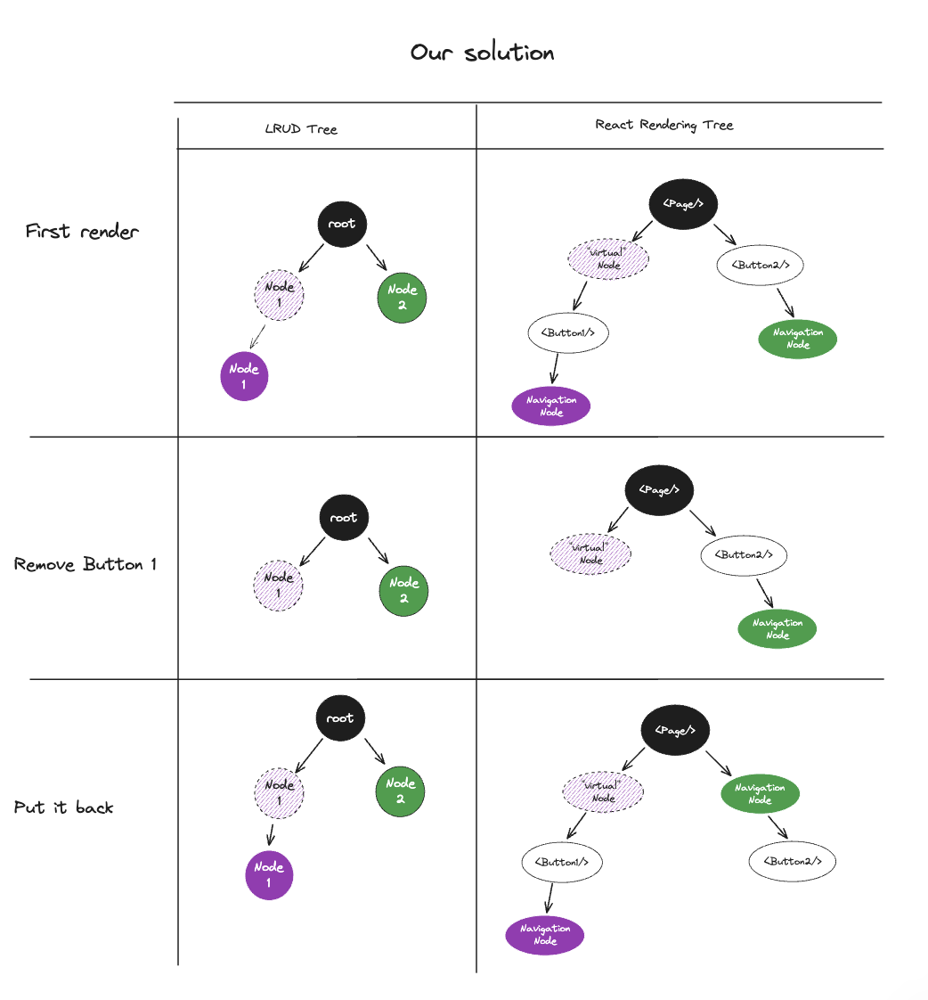

# Pitfalls


- [Conditional rendering](#conditional-rendering)
  - [TLDR](#tldr)
  - [Explanations](#explanations)
- [Accessibility](#accessibility)

## Conditional rendering

### TLDR

If navigation elements are conditionnally visible, it is necessary to wrap them with a node that will always be present. Otherwise the registering of the elements might change.

```tsx
// DON'T ❌
<View>
  <Text>Title</Text>
  {isVisible && <Element />}
</View>

// DO ✅
<View>
  <Text>Title</Text>
  <SpatialNavigationNode>{isVisible && <Element />}</SpatialNavigationNode>
</View>
```

### Explanations

If you try to hide and then show a button again naively using the library, you’ll encounter an issue.
Once re-rendered, your button will not be at the proper place! Well, for the remote control only.
Your button will still be at the top of your page, but it will be as if it was at the bottom for the remote control.



Why?

When we declare elements in LRUD, we declare them in the same order as the React rendering.
It’s our only way to know that Button 1 is above Button 2.
The problem with that, is that if you remove Button 1 from your React tree and put it back, it’s still Button1 + Button2 for React,
but the order of the LRUD declaration will change: Button1 will land AFTER Button2 for LRUD.



Solution is simple, but you need to know about it.
You simply need to wrap your conditionally rendered elements with a `<SpatialNavigationNode/>` that you never remove from the tree.
You remove its children only.
Once you do that, there is always an LRUD node living at the place of your button, and there won’t be any confusion order once your button comes back!

## Accessibility

As mentioned in [accessibility](./accessibility.md), support is experimental. And help is welcome 🙂

## React Strict Mode

It can't work 😢 Long story short: we're relying on React's rendering order
to register our elements, and the strict mode is messing with it.

You can [check this talk out](https://www.youtube.com/watch?v=Asn1TmCH2b0) to understand why.
