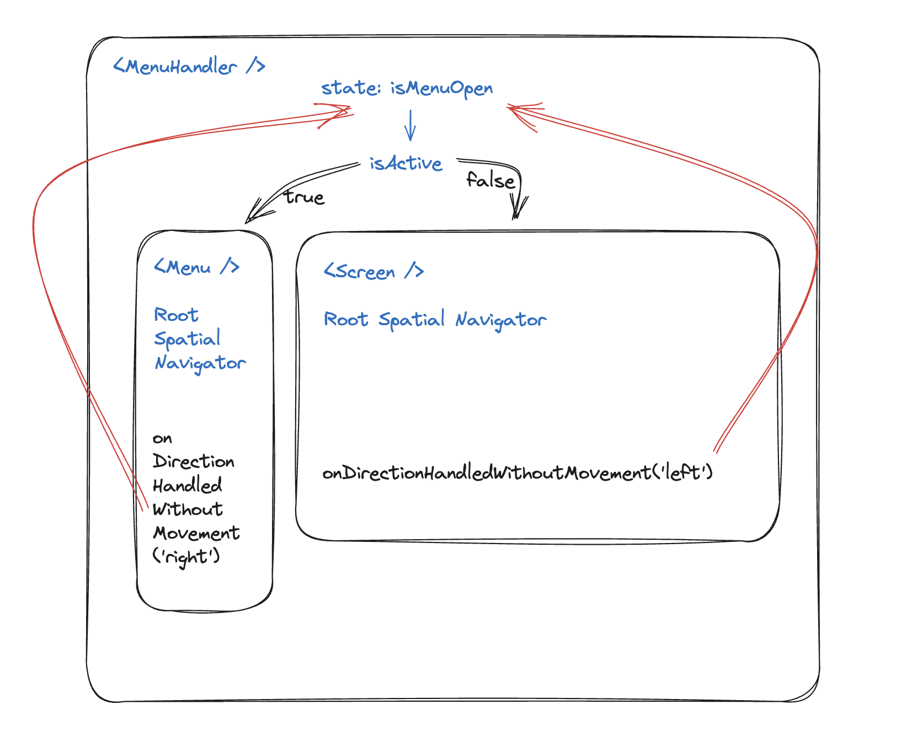

# Tutorial

First, you should install the npm package. There should be no other dependencies.

```
npm install react-tv-space-navigation
# or
yarn add react-tv-space-navigation
```

### Configure the remote control

The keys depend on the platform.
It's up to you to add event listeners to your remote control and map
them correctly depending on the platform.

Here's an example for the web platform. You can check out more platforms
in the repo example.

```tsx
import { Directions, SpatialNavigation } from 'react-tv-space-navigation';

SpatialNavigation.configureRemoteControl({
  remoteControlSubscriber: (callback) => {
    const mapping = {
      ArrowRight: Directions.RIGHT,
      ArrowLeft: Directions.LEFT,
      ArrowUp: Directions.UP,
      ArrowDown: Directions.DOWN,
      Enter: Directions.ENTER,
    };

    const eventId = window.addEventListener('keydown', (keyEvent) => {
      callback(mapping[keyEvent.code]);
    });

    return eventId;
  },

  remoteControlUnsubscriber: (eventId) => {
    window.removeEventListener('keydown', eventId);
  },
});
```

#### Some details about the remote control implementation

We unify the key events implementations under a RemoteControlManager interface.
This interface exposes a `addKeydownListener` and `removeKeydownListener`.
The latter one takes as first argument the return value of `addKeydownListener`, so that you can easily define an unsubscription logic.
We also define `SupportedKeys` as an output value for all platforms, and we map each platform to these keys.

We decline this interface on multiple platforms.

- web: quite straightforward
- android: we install `react-native-keyevent` (check out the install docs). Rest is straightforward.
- ios: we use the `react-native-tvos` API to remap the iOS keys. We do not handle the gestures yet.

You can improve this to handle gestures on tvOS.
We are considering long presses as well, but this will need an additional `onLongSelect` props on `SpatialNavigationNode`.

### Set-up a spatial navigation root

You can now create your page.

```diff
const Element = () => (
  <View>
    <Text>Page element</Text>
  </View>
);

const Page = () => {
  return (
+    <SpatialNavigationRoot>
      <Element />
      <Element />
+    </SpatialNavigationRoot>
  );
};
```

### Add spatial navigation focusable view

```diff
const Element = () => (
+  <SpatialNavigationFocusableView>
    <View>
      <Text>Page element</Text>
    </View>
+  </SpatialNavigationFocusableView>
);

const Page = () => {
  return (
    <SpatialNavigationRoot>
      <Element />
      <Element />
    </SpatialNavigationRoot>
  );
};
```

### Add behaviour when you select an element

Simply add an `onSelect` props to a node, very similarly as if you were adding a `onPress` props.

```diff
const Element = ({ onSelect }) => (
-  <SpatialNavigationFocusableView>
+  <SpatialNavigationFocusableView onSelect={onSelect}>
    {({ isFocused }) => (
      <View style={isFocused && { backgroundColor: 'green' }}>
        <Text>Page element</Text>
      </View>
    )}
  </SpatialNavigationFocusableView>
);

const Page = () => {
  return (
    <SpatialNavigationRoot>
-      <Element />
-      <Element />
+      <Element onSelect={() => console.log('selected first element')} />
+      <Element onSelect={() => console.log('selected second element')} />
    </SpatialNavigationRoot>
  );
};
```

### Add a Default Focus

To add a default focus, wrap the group of elements that you want the default focus to be on.

```diff
const Element = ({ onSelect }) => (
  <SpatialNavigationFocusableView onSelect={onSelect}>
    {({ isFocused }) => (
      <View style={isFocused && { backgroundColor: 'green' }}>
        <Text>Page element</Text>
      </View>
    )}
  </SpatialNavigationFocusableView>
);

const Page = () => {
  return (
    <SpatialNavigationRoot>
      <Element onSelect={() => console.log('selected first element')} />
+      <DefaultFocus>
        <Element onSelect={() => console.log('selected second element')} />
+      </DefaultFocus>
    </SpatialNavigationRoot>
  );
};
```

### Add a ScrollView

You will probably need an app where your content is larger than your screen. You can use the spatial scroll view to handle this.
Check out the [ScrollView API docs](https://github.com/bamlab/react-tv-space-navigation/blob/main/docs/api.md#spatialnavigationscrollview)

### Add a VirtualizedList

See the [API documentation for VirtualizedLists](./api.md#spatialnavigationvirtualizedlist).

### Handling a side menu

You can check out the example app for this.

Usually, when we integrate a side menu in a TV app, it should be persisted across pages.
It is an element on the border of the screen that is above the root view.

It would be super hard to handle it this way:

- integrate the nodes of this menu into the existing Spatial Navigator instance of a given page
- the user goes to another page
- keep the menu mounted on the left, but move its nodes to the Spatial Navigator instance of the new page ❌

To solve this, here's a solution:

- create a spatial navigator dedicated to the menu itself
- don't touch each page's spatial navigator
- add an event that detects when we're going off-screen with the remote controller
- add a wrapper above the app that detects that if we're going off-screen to the left on a screen, we should disable our page's navigator and enable our menu's navigator (and vice-versa)

> You can use `onDirectionHandledWithoutMovement` and `isActive` of `SpatialNavigationRoot` to do so

And tada 🎉



### Handling the text inputs

Check out the example app.

- You first need to lock the remote control when the keyboard appears. We've done it with the component `SpatialNavigationKeyboardLocker`.
- Your TextInput component needs to have a `SpatialNavigationNode` around it to catch our custom focus system event. Then, it needs to pass the native focus down to the native TextInput below. You can check out `TextInput.tsx` in the example app.

Another recommended solution would be to implement your own custom keyboard on your screen directly.
It allows you to embed it in your page directly next to the text field (as many famous TV apps do).
No example yet!

## Handle remote pointers

Remote pointers represents the movement-based cursor some TV have (LG and the Magic Remote for instance). To handle these movements, an API is available in the library.
Here are the key elements which can handle remote pointers :

- `SpatialNavigationDeviceTypeProvider`
- `SpatialNavigationFocusableView`
- `SpatialNavigationScrollView`
- `SpatialNavigationVirtualizedList`
- `SpatialNavigationVirtualizedGrid`

### Handling basic pointer hovering

In order to know what device the user is actively using, your app needs to have access to the `DeviceContext`. We suggest you place it a the root of your app :

```tsx
function App(): JSX.Element {
  return (
    <SpatialNavigationDeviceTypeProvider>
      <DefaultFocus>
        <SomeFocusableComponent onSelect={() => console.log('selected first element')} />
      </DefaultFocus>
      <SomeFocusableComponent onSelect={() => console.log('selected second element')} />
    </SpatialNavigationDeviceTypeProvider>
  );
}

const SomeFocusableComponent = ({ onSelect }: Props) => {
  return (
    <SpatialNavigationFocusableView onSelect={onSelect}>
      {({ isFocused }) => <View isFocused={isFocused} />} // Can be an image or whatever you want
    </SpatialNavigationFocusableView>
  );
};
```

This way, when hovering `SomeFocusableElement` with a pointer, the focus will be triggered. This is done thanks to the `SpatialNavigationFocusableView` component, which handles the hovering with a pointer. This single component is the key to make the pointer work.

### Handling scroll in virtualized lists and grids

The lists and grids have optional props to provide "arrows" which when hovered trigger a scroll of the list/grid.
The API can be found in [the corresponding documentation](api.md).

To completely handle scroll on the lists & grid, you need to provide the area hoverable, representend by `ascendingArrowContainer` and `descendingArrowContainer`. Then, you can provide your components `ascendingArrow` and `descendingArrow` which are simply aimed to be visual assets displayed for user clarity (generally, arrows pointing in the direction of the scroll).
Example of a working virtualized list :

```jsx
<SpatialNavigationVirtualizedList
  {...otherProps}
  descendingArrow={isActive ? <LeftArrow /> : null}
  descendingArrowContainerStyle={styles.leftArrowContainer}
  ascendingArrow={isActive ? <RightArrow /> : null}
  ascendingArrowContainerStyle={styles.rightArrowContainer}
/>
```

Here is also handled the hiding of the arrows when the list is not hovered, thanks to the `isActive` state !

### Handling scroll in SpatialNavigationScrollView

The principle is the same as above and the API is also the same.

```jsx
<SpatialNavigationScrollView
  {...otherProps}
  descendingArrow={<TopArrow />}
  descendingArrowContainerStyle={styles.topArrowContainer}
  ascendingArrow={<BottomArrow />}
  ascendingArrowContainerStyle={styles.bottomArrowContainer}
>
  <Element />
  <Element />
  <Element />
  {...}
</SpatialNavigationScrollView>
```
